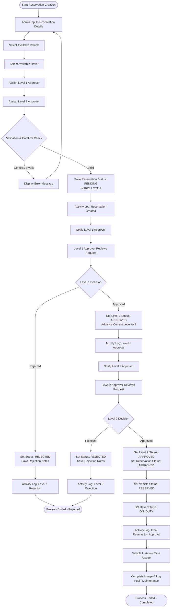

# Activity Diagram - MineFleet Reservation Workflow

```mermaid
flowchart TD
    Start([Start Reservation Creation]) --> AdminInput[Admin Inputs Reservation Details]
    AdminInput --> SelectVehicle[Select Available Vehicle]
    SelectVehicle --> SelectDriver[Select Available Driver]
    SelectDriver --> SelectL1[Assign Level 1 Approver]
    SelectL1 --> SelectL2[Assign Level 2 Approver]

    SelectL2 --> ValidateCheck{Validation & Conflicts Check}
    ValidateCheck -- Conflict / Invalid --> ReturnError[Display Error Message]
    ReturnError --> AdminInput

    ValidateCheck -- Valid --> CreatePending[Save Reservation Status: PENDING\nCurrent Level: 1]
    CreatePending --> LogCreate[Activity Log: Reservation Created]
    LogCreate --> NotifyL1[Notify Level 1 Approver]

    NotifyL1 --> WaitL1[Level 1 Approver Reviews Request]
    WaitL1 --> DecisionL1{Level 1 Decision}

    DecisionL1 -- Rejected --> RejectL1[Set Status: REJECTED\nSave Rejection Notes]
    RejectL1 --> LogRejectL1[Activity Log: Level 1 Rejection]
    LogRejectL1 --> EndReject([Process Ended - Rejected])

    DecisionL1 -- Approved --> ApproveL1[Set Level 1 Status: APPROVED\nAdvance Current Level to 2]
    ApproveL1 --> LogApproveL1[Activity Log: Level 1 Approval]
    LogApproveL1 --> NotifyL2[Notify Level 2 Approver]

    NotifyL2 --> WaitL2[Level 2 Approver Reviews Request]
    WaitL2 --> DecisionL2{Level 2 Decision}

    DecisionL2 -- Rejected --> RejectL2[Set Status: REJECTED\nSave Rejection Notes]
    RejectL2 --> LogRejectL2[Activity Log: Level 2 Rejection]
    LogRejectL2 --> EndReject

    DecisionL2 -- Approved --> ApproveL2[Set Level 2 Status: APPROVED\nSet Reservation Status: APPROVED]
    ApproveL2 --> UpdateVehicle[Set Vehicle Status: RESERVED]
    UpdateVehicle --> UpdateDriver[Set Driver Status: ON_DUTY]
    UpdateDriver --> LogApproveL2[Activity Log: Final Reservation Approval]
    LogApproveL2 --> ActiveUsage[Vehicle In Active Mine Usage]
    ActiveUsage --> CompleteUsage[Complete Usage & Log Fuel / Maintenance]
    CompleteUsage --> EndApproved([Process Ended - Completed])
```
