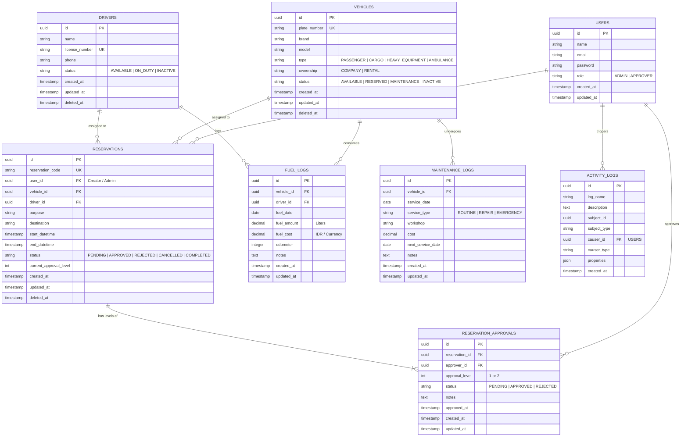

# Entity-Relationship Diagram (ERD) - MineFleet Vehicle Reservation System

```mermaid
erDiagram
    USERS {
        uuid id PK
        string name
        string email
        string password
        string role "ADMIN | APPROVER"
        timestamp created_at
        timestamp updated_at
    }

    VEHICLES {
        uuid id PK
        string plate_number UK
        string brand
        string model
        string type "PASSENGER | CARGO | HEAVY_EQUIPMENT | AMBULANCE"
        string ownership "COMPANY | RENTAL"
        string status "AVAILABLE | RESERVED | MAINTENANCE | INACTIVE"
        timestamp created_at
        timestamp updated_at
        timestamp deleted_at
    }

    DRIVERS {
        uuid id PK
        string name
        string license_number UK
        string phone
        string status "AVAILABLE | ON_DUTY | INACTIVE"
        timestamp created_at
        timestamp updated_at
        timestamp deleted_at
    }

    RESERVATIONS {
        uuid id PK
        string reservation_code UK
        uuid user_id FK "Creator / Admin"
        uuid vehicle_id FK
        uuid driver_id FK
        string purpose
        string destination
        timestamp start_datetime
        timestamp end_datetime
        string status "PENDING | APPROVED | REJECTED | CANCELLED | COMPLETED"
        int current_approval_level
        timestamp created_at
        timestamp updated_at
        timestamp deleted_at
    }

    RESERVATION_APPROVALS {
        uuid id PK
        uuid reservation_id FK
        uuid approver_id FK
        int approval_level "1 or 2"
        string status "PENDING | APPROVED | REJECTED"
        text notes
        timestamp approved_at
        timestamp created_at
        timestamp updated_at
    }

    FUEL_LOGS {
        uuid id PK
        uuid vehicle_id FK
        uuid driver_id FK
        date fuel_date
        decimal fuel_amount "Liters"
        decimal fuel_cost "IDR / Currency"
        integer odometer
        text notes
        timestamp created_at
        timestamp updated_at
    }

    MAINTENANCE_LOGS {
        uuid id PK
        uuid vehicle_id FK
        date service_date
        string service_type "ROUTINE | REPAIR | EMERGENCY"
        string workshop
        decimal cost
        date next_service_date
        text notes
        timestamp created_at
        timestamp updated_at
    }

    ACTIVITY_LOGS {
        uuid id PK
        string log_name
        text description
        uuid subject_id
        string subject_type
        uuid causer_id FK "USERS"
        string causer_type
        json properties
        timestamp created_at
    }

    USERS ||--o{ RESERVATIONS : "creates"
    USERS ||--o{ RESERVATION_APPROVALS : "approves"
    VEHICLES ||--o{ RESERVATIONS : "assigned to"
    DRIVERS ||--o{ RESERVATIONS : "assigned to"
    RESERVATIONS ||--|{ RESERVATION_APPROVALS : "has levels of"
    VEHICLES ||--o{ FUEL_LOGS : "consumes"
    DRIVERS ||--o{ FUEL_LOGS : "logs"
    VEHICLES ||--o{ MAINTENANCE_LOGS : "undergoes"
    USERS ||--o{ ACTIVITY_LOGS : "triggers"
```
