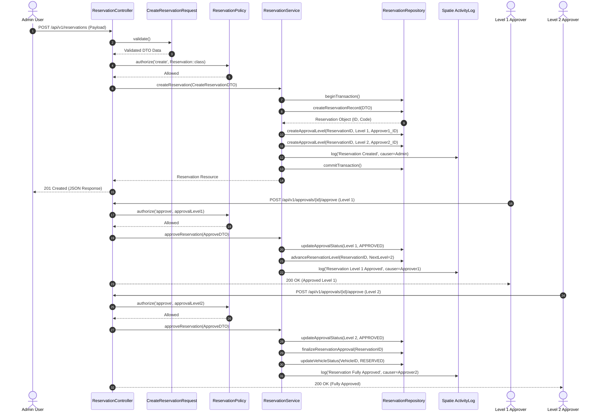

# Sequence Diagram - MineFleet Reservation & Approval Flow

```mermaid
sequenceDiagram
    autonumber
    actor Admin as Admin User
    participant Controller as ReservationController
    participant Req as CreateReservationRequest
    participant Policy as ReservationPolicy
    participant Service as ReservationService
    participant Repo as ReservationRepository
    participant Activity as Spatie ActivityLog
    actor Approver1 as Level 1 Approver
    actor Approver2 as Level 2 Approver

    Admin->>Controller: POST /api/v1/reservations (Payload)
    Controller->>Req: validate()
    Req-->>Controller: Validated DTO Data
    Controller->>Policy: authorize('create', Reservation::class)
    Policy-->>Controller: Allowed

    Controller->>Service: createReservation(CreateReservationDTO)
    Service->>Repo: beginTransaction()
    Service->>Repo: createReservationRecord(DTO)
    Repo-->>Service: Reservation Object (ID, Code)

    Service->>Repo: createApprovalLevel(ReservationID, Level 1, Approver1_ID)
    Service->>Repo: createApprovalLevel(ReservationID, Level 2, Approver2_ID)

    Service->>Activity: log('Reservation Created', causer=Admin)
    Service->>Repo: commitTransaction()
    Service-->>Controller: Reservation Resource
    Controller-->>Admin: 201 Created (JSON Response)

    %% Level 1 Approval
    Approver1->>Controller: POST /api/v1/approvals/{id}/approve (Level 1)
    Controller->>Policy: authorize('approve', approvalLevel1)
    Policy-->>Controller: Allowed
    Controller->>Service: approveReservation(ApproveDTO)
    Service->>Repo: updateApprovalStatus(Level 1, APPROVED)
    Service->>Repo: advanceReservationLevel(ReservationID, NextLevel=2)
    Service->>Activity: log('Reservation Level 1 Approved', causer=Approver1)
    Controller-->>Approver1: 200 OK (Approved Level 1)

    %% Level 2 Approval
    Approver2->>Controller: POST /api/v1/approvals/{id}/approve (Level 2)
    Controller->>Policy: authorize('approve', approvalLevel2)
    Policy-->>Controller: Allowed
    Controller->>Service: approveReservation(ApproveDTO)
    Service->>Repo: updateApprovalStatus(Level 2, APPROVED)
    Service->>Repo: finalizeReservationApproval(ReservationID)
    Service->>Repo: updateVehicleStatus(VehicleID, RESERVED)
    Service->>Activity: log('Reservation Fully Approved', causer=Approver2)
    Controller-->>Approver2: 200 OK (Fully Approved)
```
